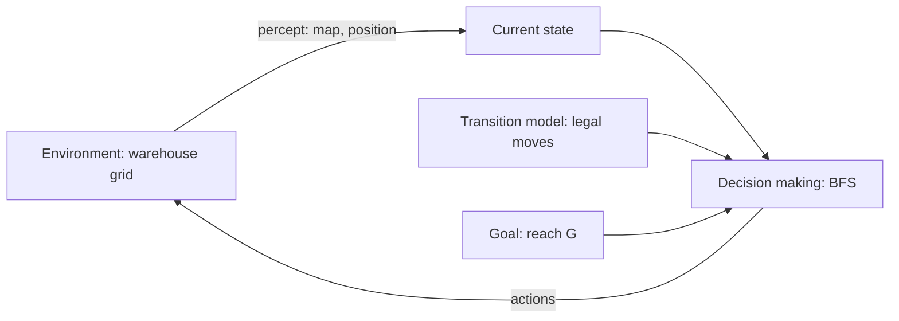

# Agents Lab: A Goal-Based Agent Built with an LLM

**Files in this folder**

| File | What it is |
|---|---|
| `warehouse_agent.py` | The final goal-based agent (BFS path planner) with built-in self-checks |
| `output.txt` | Output of `python3 warehouse_agent.py` |
| `prompts.md` | The prompts given to the LLM, and what was changed afterwards |

Run it with: `python3 warehouse_agent.py` (Python 3, standard library only).

---

## Task 1: Understanding the Problem

1. **Environment.** A warehouse floor modelled as a 7 × 21 grid. Each cell is either free (`.`), an obstacle/shelf (`#`), the start (`S`) or the goal (`G`). The environment is fully observable (the agent has the whole map), deterministic (a move always goes to the cell it targets), static (shelves don't move), discrete, and has a single agent.
2. **Goal.** Move the vehicle from the loading bay `S` at (row 1, col 1) to the dispatch area `G` at (1, 19) without entering an obstacle cell.
3. **Actions.** `Up`, `Down`, `Left`, `Right`. Each one moves the vehicle one cell. A move is only valid if the target cell is inside the grid and is not `#`.
4. **Information the agent must keep.** Its current position (the state), the goal position, the map (to tell which successor cells are legal), and while it plans: the frontier of states still to explore, the set of states already reached, and a parent pointer for each reached state so the path can be rebuilt.
5. **Why it is goal-based and not a simple reflex agent.** A reflex agent maps the current percept straight to an action ("if the cell to the right is free, go right"). In this map that strategy runs into the dead end at (1,5): going right is blocked by the wall at (1,6), and only looking ahead shows that the vehicle has to drop down to row 2 and come back up. The goal-based agent holds an explicit goal and asks "which sequence of actions leads to the goal?", so it compares future consequences of actions instead of reacting to the current cell.

**Think about it: a warehouse twice as large.** BFS still works and still gives shortest paths, but time and memory grow with the number of cells. Doubling both dimensions gives 4× the cells, and BFS may have to store most of them. For very large maps an informed search such as A* with a Manhattan heuristic expands far fewer states. Other problems that appear at scale: several vehicles sharing the floor (collision avoidance in time as well as space), shelves or people moving (so the map is no longer static and the agent must replan), unequal move costs (turns, congested aisles), and partial observability if the vehicle only senses nearby cells.

---

## Task 2: Agent Design

| Component | Design |
|---|---|
| Environment | 2-D grid of characters parsed from the ASCII map |
| Current state | `(row, col)` tuple for the vehicle's position |
| Goal | `(row, col)` of `G`; goal test is `state == goal` |
| Actions | `{Up:(-1,0), Down:(1,0), Left:(0,-1), Right:(0,1)}` |
| Transition model | `successors(state)` applies each action and keeps only in-bounds, non-`#` cells |
| Decision-making component | BFS planner: frontier queue + visited/parent map, rebuilds the path at the goal |

**Block diagram** (goal-based agent architecture from the lecture):

```
            +-------------------------- AGENT ---------------------------+
            |                                                             |
 percept    |  +-----------+     "what is the world   +---------------+   |
 (map, S) --+->|  State    |----- like now?" -------->|  Planner      |   |
            |  | (row,col) |                          |  (BFS search) |   |
            |  +-----------+     +-----------------+  |               |   |
            |                    | Transition model|->|  "what happens|   |
            |                    | successors(s)   |  |   if I do a?" |   |
            |                    +-----------------+  |               |   |
            |                    +-----------------+  |               |   |
            |                    |  Goal: s == G   |->|  "does it     |   |
            |                    +-----------------+  |   reach G?"   |   |
            |                                         +-------+-------+   |
            +-------------------------------------------------|-----------+
                                                              | action sequence
                                                              v (Up/Down/Left/Right)
                                                   +---------------------+
                                                   | ENVIRONMENT         |
                                                   | warehouse grid      |
                                                   +---------------------+
```



---

## Task 3: Prompt Engineering and Testing

The prompt (see `prompts.md`) was the suggested specification, plus the exact map and the requirement to print the path. The LLM used was Claude.

**Result on the lab map** (`output.txt`):

```
Path found: 20 moves
Actions: Right Right Right Down Right Right Right Up Right Right Right Right Right Right Right Right Right Right Right Right
#####################
#S***.#************G#
#.##****##########..#
#....##.............#
#.######.###.#.###..#
#........#..........#
#####################
```

**Checking that 20 is optimal.** The Manhattan distance from S (1,1) to G (1,19) is 18, so no path can be shorter than 18 moves. Row 1 is blocked at column 6, so the vehicle must leave row 1 and come back, which adds at least 2 vertical moves. 18 + 2 = 20, so the BFS path matches the lower bound and is a shortest path. A no-path map (`#S#G#`) was also tested, and the agent prints "No path exists from S to G." Both checks are `assert` statements in the script.

### Questions

1. **Did the LLM generate a working program on the first attempt?** It ran on the first attempt and found a valid path. One thing did fail on the first run: the self-check asserted that the path length was 24, a number written before the program had been run. The program printed 20. Working out the Manhattan lower bound by hand (above) showed that 20 was right and the expected value was wrong, so the assertion was changed. This is the main lesson of the lab: the number in the test also has to be justified, not just the code.
2. **How could the prompt be improved?** Ask for (a) a stated expected result to test against, with the reason for it (for example a lower bound), (b) explicit test maps, including a map with no path and a map where S is next to G, (c) a fixed output format (number of moves, action list, drawn map), and (d) no third-party libraries. Giving the grid coordinates of S and G also removes ambiguity about indexing.
3. **Which search algorithm did the LLM choose?** Breadth-first search.
4. **Why that algorithm?** Every move costs the same (1), so BFS is complete and returns a shortest path, which is exactly the requirement. It is also the simplest optimal algorithm here: no heuristic and no priority queue, and the map has only about 70 free cells, so efficiency doesn't matter. A* with Manhattan distance would also be optimal and would expand fewer cells on a large map. DFS would find *a* path but not necessarily a short one.

---

## Reflection on LLM-assisted development

- **Strengths:** the LLM turned a clear specification into clean, documented code within seconds, and explained correctly why it picked the algorithm.
- **Limitations:** a confidently written expected value (24) was wrong. Only running the code and reasoning independently about a lower bound found the problem. An LLM's output, including its tests, is a hypothesis that has to be checked.
- **What the human still has to do:** specify the problem (states, actions, goal), choose test cases whose correct answers are known for a stated reason, and judge whether the output is actually optimal and not just plausible.
